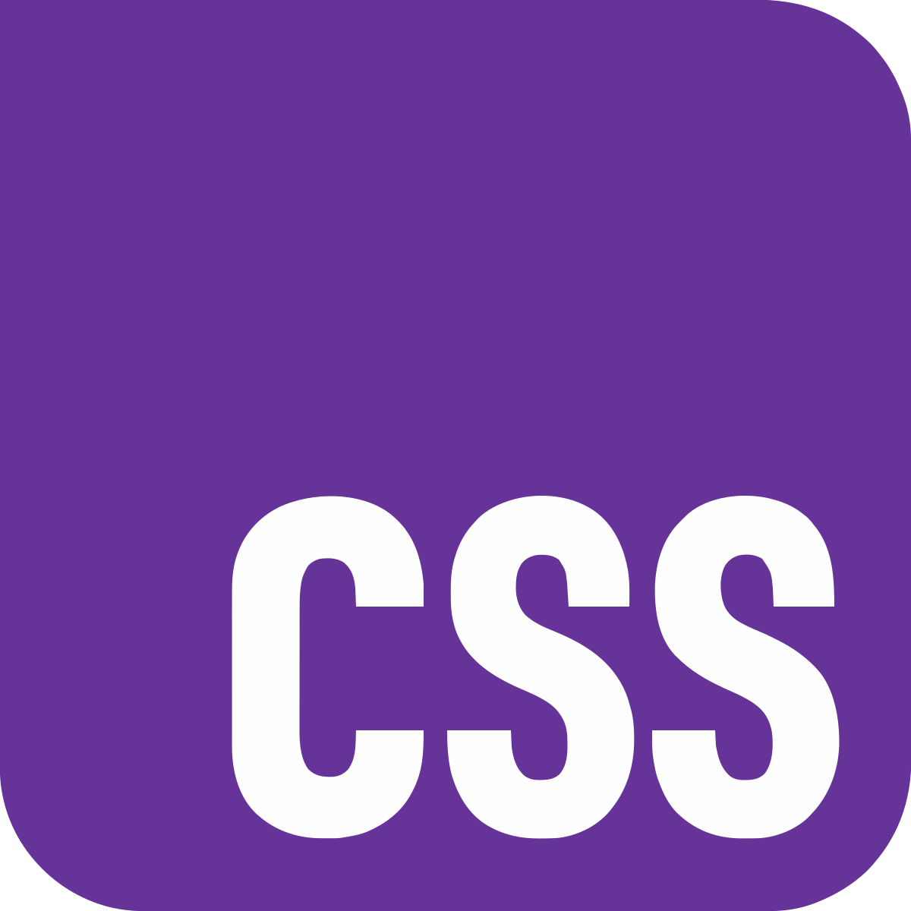

<h1 align="center">Hey 👋 I'm Juan</h1>

<h3 align="center">Fullstack Developer from Uruguay 🇺🇾</h3>

###

  
  
  
  
  
  
  
  
  
  
  
  
  
  
  
  
  
  
  

###

  
  
  
  
  
  
  
  
  
  
  
  
  
  
  
  
  

###

🚀 Fullstack developer and advanced computer science student. 
I enjoy building scalable backends, clean frontends and learning new technologies every day.

###

  
  

###

<picture>
  <source media="(prefers-color-scheme: dark)"
    srcset="https://raw.githubusercontent.com/juanpeyrot/juanpeyrot/output/pacman-contribution-graph-dark.svg">
  <source media="(prefers-color-scheme: light)"
    srcset="https://raw.githubusercontent.com/juanpeyrot/juanpeyrot/output/pacman-contribution-graph.svg">
  
</picture>
